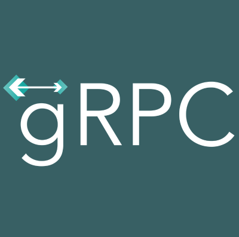

# Jaisumer Sandhu  
### 3rd Year Software Engineering Student @ University of Calgary  
### Software Engineering Intern @ [ZeroSound Systems Inc.](https://zerosound.com)

---

### 🌐 Reach Me On My Socials  
#### *Get Clicking!*

---

## 🧠 Technological Skill Stack

### 📝 Languages  

  
  

### 🧪 Machine Learning & Data Science  

  
  
  
  
  

### ⚙️ Frameworks  

  

### 📦 Libraries & Tools  

  
  
  
  
  

### 🛠️ Dev Tools, Platforms & Databases  

  
  

